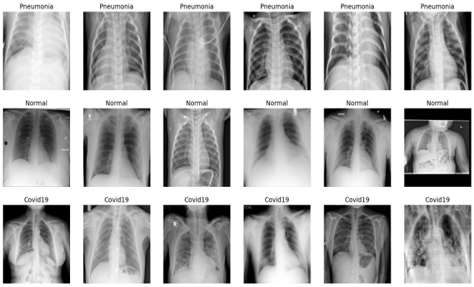
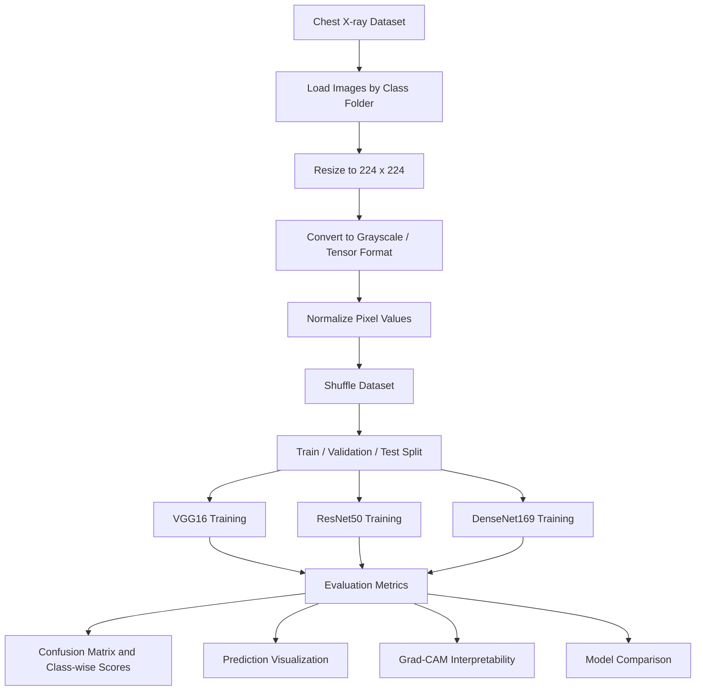
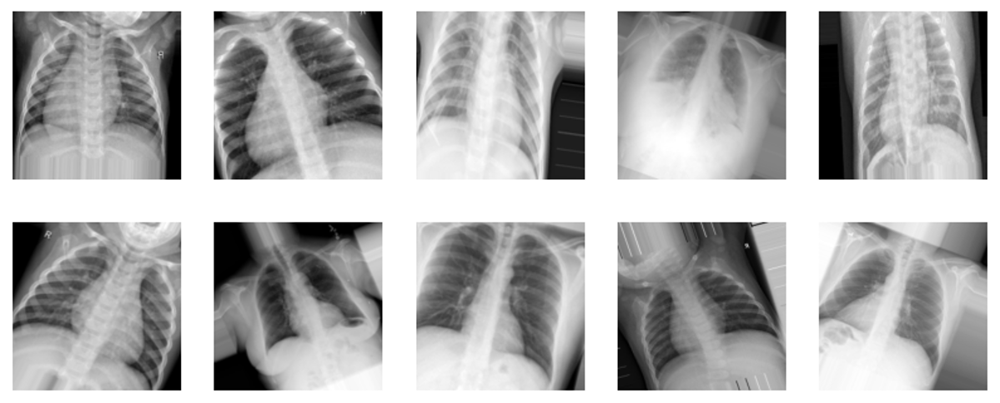

<h1 align="center">Chest X-ray Classification: COVID-19, Pneumonia, and Normal</h1>

<p align="center">
  <b>Deep learning pipeline for classifying chest X-ray images into three clinical categories</b>
</p>

<p align="center">
  
  
  
  
  
</p>

<p align="center">
  
</p>

## Overview

This project builds and evaluates a chest X-ray image classification pipeline for three classes: `COVID-19`, `Pneumonia`, and `Normal`. The repository contains training, evaluation, comparison, visualization, and interpretability notebooks for multiple deep learning architectures.

The main goal is to compare transfer learning models on the same X-ray dataset and analyze their behavior through validation curves, confusion matrices, per-class metrics, visual prediction examples, and Grad-CAM heatmaps.

Main models in the project:

- `VGG16` with TensorFlow/Keras.
- `ResNet50` with TensorFlow/Keras.
- `DenseNet169` with PyTorch/torchvision.

## Problem

Chest X-ray interpretation can support fast screening for respiratory diseases, but manual review is time-consuming and depends on clinical expertise. This project focuses on a supervised image classification task:

- Input: a grayscale chest X-ray image.
- Output: one of three labels: `COVID-19`, `Pneumonia`, or `Normal`.
- Objective: train deep learning models that can classify the disease category accurately and provide visual evidence for the model decision.

## Pipeline Architecture



## Detailed Workflow

### 1. Data Loading

The notebooks load images from Kaggle-style folder structures where each class is stored in its own directory.

```text
Train_COVID19_Pneumonia_Normal/
  train/
    Pneumonia/
    Normal/
    Covid19/
  val/
    Pneumonia/
    Normal/
    Covid19/

Test_COVID19_Pneumonia_Normal/
  test/
    Pneumonia/
    Normal/
    Covid19/
```

The training notebooks use:

| Split | Total images | Pneumonia | Normal | COVID-19 |
|---|---:|---:|---:|---:|
| Train | 21,418 | 7,912 | 10,153 | 3,353 |
| Validation | 1,337 | 494 | 634 | 209 |
| Test | 4,020 | 1,485 | 1,905 | 630 |

### 2. Preprocessing

Each image is processed with the same base steps:

- Read image files from the class folders.
- Convert images to grayscale where required.
- Resize images to `224 x 224`.
- Reshape data into model-compatible tensors.
- Normalize pixel values to the `[0, 1]` range.
- Shuffle samples with a fixed random seed to reduce ordering bias.

<p align="center">
  
</p>

### 3. Data Augmentation

The TensorFlow/Keras notebooks include image augmentation to improve generalization and reduce overfitting. Typical augmentation operations include geometric transforms and small image variations suitable for X-ray classification.

### 4. Model Training

The repository trains and compares three CNN-based transfer learning models:

| Model | Framework | Main notebook | Role |
|---|---|---|---|
| VGG16 | TensorFlow/Keras | `Code/VGG16.ipynb` | Baseline transfer learning CNN |
| ResNet50 | TensorFlow/Keras | `Code/ResNet50.ipynb` | Residual network comparison model |
| DenseNet169 | PyTorch/torchvision | `Code/densenet.ipynb` | Dense connection model with the best reported result |

The notebooks save the best model checkpoint during training and then evaluate the trained model on validation or test data.

### 5. Model Evaluation

The project evaluates model performance with:

- Accuracy.
- Precision.
- Recall.
- F1-score.
- Confusion matrix.
- Per-class metrics.
- Prediction visualization.
- Grad-CAM heatmaps.

## Models Used

### VGG16

VGG16 is used as a strong CNN baseline. The notebook trains the model on resized chest X-ray images and evaluates it with validation accuracy, loss curves, confusion matrix, and class-wise metrics.

### ResNet50

ResNet50 introduces residual connections, helping deeper networks train more effectively. In this project, ResNet50 improves over VGG16 and provides strong validation accuracy.

### DenseNet169

DenseNet169 uses dense feature reuse between layers. The PyTorch notebook uses a pretrained DenseNet169 backbone and adapts the classifier head for the three-class X-ray task.

## Experimental Results

### Validation Results from Training Notebooks

| Model | Loss | Accuracy |
|---|---:|---:|
| VGG16 | 0.0854 | 96.63% |
| ResNet50 | 0.0880 | 97.08% |
| DenseNet169 | - | 99.15% |

### Final Comparison

The comparison notebook reports the following weighted metrics:

| Model | Accuracy | Precision | Recall | F1-score |
|---|---:|---:|---:|---:|
| VGG16 | 0.969 | 0.969 | 0.969 | 0.969 |
| ResNet50 | 0.976 | 0.976 | 0.976 | 0.976 |
| DenseNet169 | 0.990 | 0.990 | 0.990 | 0.990 |

<p align="center">
  
</p>

DenseNet169 achieved the best overall score in the project, followed by ResNet50 and VGG16.

## Evaluation Visualizations

The repository includes a full set of figures for dataset inspection, model structure, training behavior, model evaluation, and prediction examples.

### Dataset Distribution

<table>
  <tr>
    <td align="center"><b>Training Set</b></td>
    <td align="center"><b>Validation Set</b></td>
    <td align="center"><b>Test Set</b></td>
  </tr>
  <tr>
    <td></td>
    <td></td>
    <td></td>
  </tr>
</table>

### Model Architectures

<table>
  <tr>
    <td align="center"><b>VGG16</b></td>
    <td align="center"><b>ResNet50</b></td>
    <td align="center"><b>DenseNet169</b></td>
  </tr>
  <tr>
    <td></td>
    <td></td>
    <td></td>
  </tr>
</table>

### Training Curves

<table>
  <tr>
    <td align="center"><b>VGG16</b></td>
    <td align="center"><b>ResNet50</b></td>
    <td align="center"><b>DenseNet169</b></td>
  </tr>
  <tr>
    <td></td>
    <td></td>
    <td></td>
  </tr>
</table>

### Confusion Matrices

<table>
  <tr>
    <td align="center"><b>VGG16</b></td>
    <td align="center"><b>ResNet50</b></td>
    <td align="center"><b>DenseNet169</b></td>
  </tr>
  <tr>
    <td></td>
    <td></td>
    <td></td>
  </tr>
</table>

### Class-wise Metrics

<table>
  <tr>
    <td align="center"><b>VGG16</b></td>
    <td align="center"><b>ResNet50</b></td>
    <td align="center"><b>DenseNet169</b></td>
  </tr>
  <tr>
    <td></td>
    <td></td>
    <td></td>
  </tr>
</table>

### Visual Prediction Results

<table>
  <tr>
    <td align="center"><b>VGG16</b></td>
    <td align="center"><b>ResNet50</b></td>
    <td align="center"><b>DenseNet169</b></td>
  </tr>
  <tr>
    <td></td>
    <td></td>
    <td></td>
  </tr>
</table>

### Overall Comparison and Grad-CAM

<table>
  <tr>
    <td align="center"><b>Model Comparison</b></td>
    <td align="center"><b>Grad-CAM Example</b></td>
  </tr>
  <tr>
    <td></td>
    <td></td>
  </tr>
</table>

## Grad-CAM Interpretability

Grad-CAM is used to visualize which regions of a chest X-ray contribute most strongly to a model prediction. This is important for medical image classification because high accuracy alone is not enough; the model should also focus on clinically meaningful image regions.

The notebook workflow includes:

- Choose a trained CNN model.
- Select a target image.
- Compute class activation heatmaps.
- Overlay the heatmap on the original X-ray.
- Inspect whether the model attends to relevant lung regions.

## Folder Structure

```text
.
|-- Code/
|   |-- All.ipynb
|   |-- VGG16.ipynb
|   |-- ResNet50.ipynb
|   |-- densenet.ipynb
|   |-- densenet_Fine-tuning .ipynb
|   |-- evaluate.ipynb
|   `-- soSanh.ipynb
|-- Imgae/
|   |-- Data.png
|   |-- imageAfterProsessing.png
|   |-- Visualization loss & accuracy.png
|   |-- Visualization loss & accuracy  ResNet50.png
|   |-- Visualization loss & accuracy DenseNet169.png
|   |-- KET QUA & DANH GIA so sanh 3 model.png
|   `-- other result images
|-- References/
|   |-- Nhom3.pptx
|   `-- 422001503101_Nhom3_PhanTichXQuangPhoiPhatHienCovid19_Viemphoi_Binhthuong.docx
|-- README.md
`-- README_en.md
```

Note: the image folder is named `Imgae` in the repository.

## Installation

The notebooks were prepared for a Kaggle/Colab-style environment with GPU support. A local environment can be created with:

```bash
python -m venv .venv
source .venv/bin/activate
pip install -U pip
pip install tensorflow keras torch torchvision scikit-learn opencv-python numpy pandas matplotlib seaborn scikit-image tqdm jupyter
```

On Windows PowerShell:

```powershell
python -m venv .venv
.\.venv\Scripts\Activate.ps1
pip install -U pip
pip install tensorflow keras torch torchvision scikit-learn opencv-python numpy pandas matplotlib seaborn scikit-image tqdm jupyter
```

## Quick Start

### 1. Prepare the Dataset

Place the dataset in the same class-folder format used by the notebooks:

```text
train/
  Pneumonia/
  Normal/
  Covid19/
val/
  Pneumonia/
  Normal/
  Covid19/
test/
  Pneumonia/
  Normal/
  Covid19/
```

If running outside Kaggle, update the dataset paths in the notebooks. For example:

```python
train = get_data("path/to/train")
val = get_data("path/to/val")
test = get_data("path/to/test")
```

### 2. Run a Model Notebook

Open Jupyter Notebook:

```bash
jupyter notebook
```

Then run one of:

```text
Code/VGG16.ipynb
Code/ResNet50.ipynb
Code/densenet.ipynb
```

### 3. Compare Models

Use the comparison notebook:

```text
Code/soSanh.ipynb
```

This notebook computes and plots accuracy, precision, recall, and F1-score for VGG16, ResNet50, and DenseNet169.

### 4. Run Evaluation

Use:

```text
Code/evaluate.ipynb
```

This notebook loads saved model files and evaluates them on the test dataset.

## Expected Outputs

After running the notebooks, the expected outputs include:

- Training history plots.
- Validation and test accuracy.
- Precision, recall, and F1-score.
- Confusion matrices.
- Per-class evaluation charts.
- Visual prediction samples.
- Grad-CAM heatmaps.
- Model comparison plot.

## Highlights

- End-to-end X-ray classification workflow.
- Three-class classification: COVID-19, Pneumonia, and Normal.
- Multiple CNN architectures compared under the same task.
- Both TensorFlow/Keras and PyTorch implementations are included.
- Evaluation includes class-wise metrics and confusion matrices.
- Grad-CAM is used to support model interpretability.
- Saved images and reference files make the project suitable for reports and presentations.

## Current Limitations

- The notebooks use Kaggle-specific dataset paths, so local users must update paths before running.
- The dataset is class-imbalanced, especially for the COVID-19 class.
- The project is notebook-based and not yet packaged as reusable Python modules.
- No single `requirements.txt` file is currently included.
- The current repository does not include trained model weights directly.
- Medical predictions should be treated as research/demo outputs, not clinical diagnosis.

## Future Work

- Add a `requirements.txt` or `environment.yml` file.
- Refactor repeated preprocessing and evaluation code into Python modules.
- Add a simple inference script for single-image prediction.
- Add a web interface for uploading and classifying X-ray images.
- Improve dataset documentation and include exact dataset source links.
- Add cross-validation or external validation on another X-ray dataset.
- Add more interpretability methods such as Score-CAM or integrated gradients.

## Project Team

Project topic: **Chest X-ray classification for detecting COVID-19, Pneumonia, and Normal cases**.

The repository includes Group 3 report materials in the `References/` folder:

```text
References/
  Nhom3.pptx
  422001503101_Nhom3_PhanTichXQuangPhoiPhatHienCovid19_Viemphoi_Binhthuong.docx
```

## References in This Repository

- `References/Nhom3.pptx`: project presentation.
- `References/422001503101_Nhom3_PhanTichXQuangPhoiPhatHienCovid19_Viemphoi_Binhthuong.docx`: project report document.
- `Code/*.ipynb`: training, evaluation, visualization, comparison, and Grad-CAM notebooks.

## License

No license file is currently declared in this repository. If the project is published publicly, consider adding a `LICENSE` file so others know how the code, notebooks, and figures may be used.
